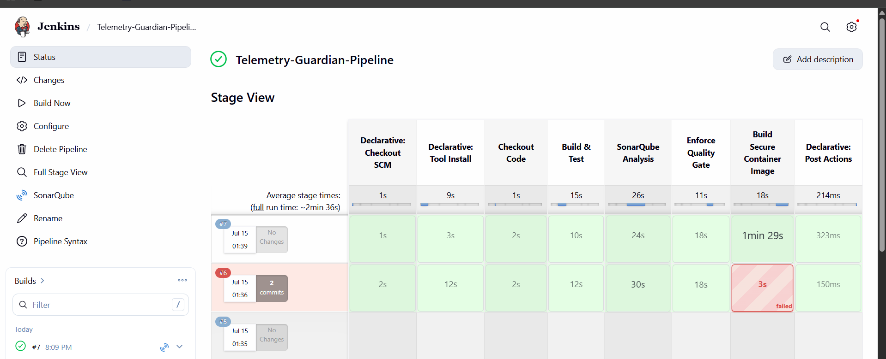
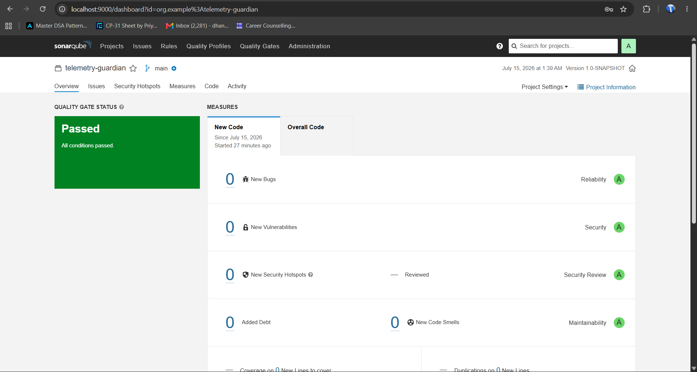
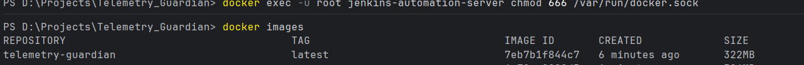
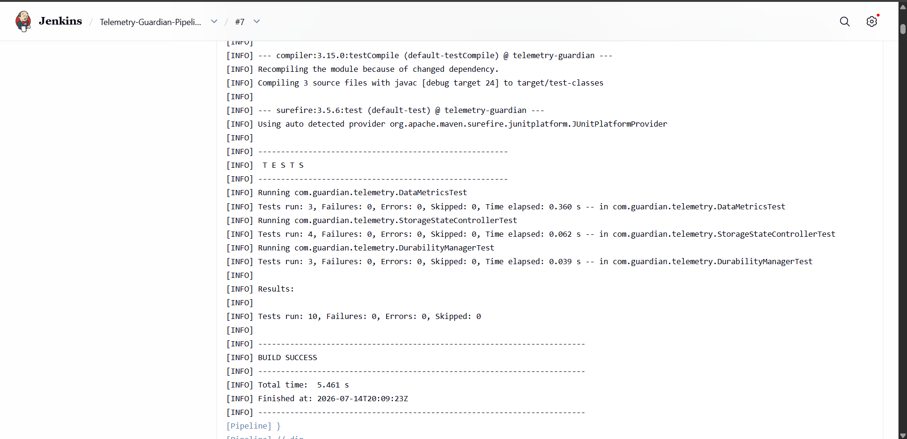

# Telemetry Guardian — Enterprise DevSecOps Pipeline

Telemetry Guardian is a high-performance Java 24 backend application managed by an automated, production-grade DevSecOps CI/CD pipeline. The project enforces strict code quality thresholds, static application security testing (SAST), and automated multi-stage containerization workflows.

## Tech Stack & Ecosystem
* **Core Application:** Java 24, Maven, JUnit 5
* **CI/CD Automation:** Jenkins (Declarative Pipeline-as-Code)
* **Code Security & Quality (SAST):** SonarQube Engine
* **Containerization:** Docker (Multi-stage architecture targeting the local daemon socket)

---

## CI/CD Pipeline Workflow
The automated deployment lifecycle is explicitly managed via a `Jenkinsfile` running the following asynchronous stages:

1. **Checkout Code:** Automated Git source control fetching.
2. **Build & Test:** Provisions an isolated `JDK 24` environment via Jenkins Global Tools to compile source code and execute the JUnit test suite.
3. **SonarQube Analysis:** Triggers deep-scan static code analysis to detect bugs, code smells, and security hotspots.
4. **Enforce Quality Gate:** Suspends pipeline execution to actively poll the SonarQube API, safely validating compliance thresholds before deployment.
5. **Build Secure Container:** Integrates with the host system's Docker socket (`/var/run/docker.sock`) using the managed `dockerTool` CLI binary to assemble an optimized production container image.

---

## Pipeline Execution & Architecture Proof

### 1. CI/CD Stage View Dashboard
Below is the successful execution graph of the Declarative Pipeline showing all 5 structural verification blocks passing consecutively:

### 2. SonarQube Security Quality Gate
The background analysis engine verified the source code architecture, confirming that the application passed all security compliance checks:

### 3. Local Container Engine Registry
Verification of the final multi-stage production Docker image built successfully by the pipeline and registered in the host architecture:

### 4. Automated JUnit Test Execution
The pipeline leverages the Maven Surefire plugin to isolate and execute unit test suites during the execution lifecycle, verifying core application logic with zero failures:

---

